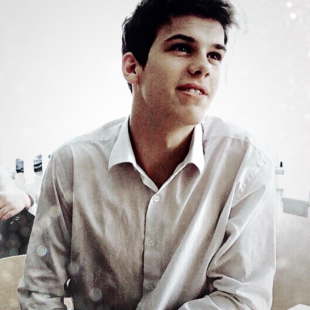

# Strizhko Ivan
#### WEB DESIGN DEVELOPER

### ABOUT ME
I'm a beginner Javascript developer. At the moment I am working in a different field of activity, studying Javascript in parallel. Since I am interested in Javascript and enjoy it, I plan to develop in this direction and in the future I plan to become a senior.
* Birth 10.09.1998
* Web web.com
* Phone +7-(771)-353-11-49
* Mail Ivan89919001@GMAIL.COM

### SKILLS 
* HTML 7/10
* JAVASCRIPT 7/10
* PHOTOSHOP 5/10
* CSS 7/10

### LANGUAGES
* ENGLISH 4/10
* RUSSIAN 10/10
* KAZAKH 2/10

### EDUCATION
##### 2016-2020
#### Saken Seifullin Kazakh Agrotechnical University
Specialty: Information Systems GPA:3.23
##### 2017-2020
#### ITStep Academy
Specialty: Cybersecurity, Networking and System Administration, certification cisco CCNA. 